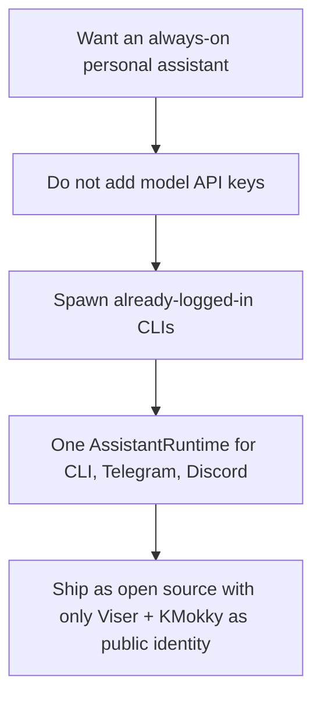
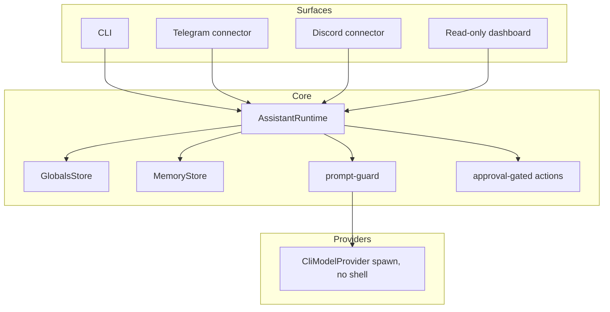

# Part 1 — Identity and principles

Creator credit: **KMokky**. Public files should not include personal handles,
emails, local machine paths, messenger IDs, tokens, or private `.viser/` state.

## Why Viser exists

OpenClaw- and Hermes-style assistants are useful when they:

- talk through a CLI and optional messengers,
- remember operator preferences,
- keep a durable always-on personality,
- and do real local work without becoming an unbounded cloud agent.

Viser keeps that shape, but the model path is a **logged-in local CLI**, not a
billed HTTP API client.

## Product name and runtime identity

| Surface | Value |
| --- | --- |
| Assistant name | `Viser` |
| Creator | `KMokky` |
| Default config | `config/viser.config.example.json` |
| Entrypoint | `node src/index.ts` / `viser` |

`audit` and `release-evidence` fail if the runtime name is not Viser or if
public files leak personal identifiers beyond the allowed creator credit.

## Layering

The completion work in this journal set does not invent a new architecture. It
fills the remaining product gaps on top of that already-running loop.
