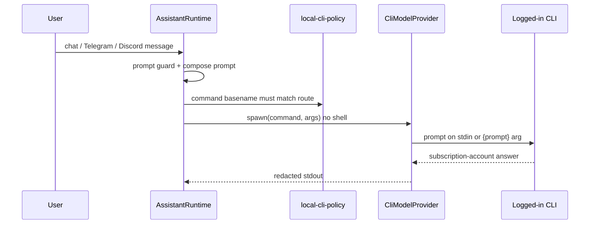

# Part 2 — Local CLI providers

The remaining provider gap was explicit **Grok** and **Cursor** subscription
CLIs. GPT/Gemini/Claude already used logged-in local commands. The same rule
now covers all five families.

## Exact command basenames

`src/core/local-cli-policy.ts` is the shared policy used by audit and release
evidence:

| Route | Config ids | Required command |
| --- | --- | --- |
| GPT/Codex | `codex`, `gpt` | `codex` |
| Gemini | `gemini` | `gemini` |
| Claude | `claude` | `claude` |
| Grok | `grok` | `grok` |
| Cursor | `cursor` | `cursor-agent` |

If a configured route is rewritten as an HTTP/API wrapper, `audit` and config
validation both fail. Grok and Cursor are first-class configured routes, but
they stay off the default `fallbackProviders` list (`gemini`, `claude`, `gpt`)
so a machine without those CLIs installed does not fail every retry. Set
`assistant.fallbackProviders` or `--provider grok` / `--provider cursor` when
those CLIs are logged in.

## Default spawn shapes

These are the default args. They are local CLIs, not SDK clients:

- `codex exec --skip-git-repo-check --sandbox read-only -` with stdin prompt
- `gemini --prompt "{prompt}" --approval-mode plan`
- `claude -p "{prompt}"`
- `grok --prompt "{prompt}"`
- `cursor-agent --print "{prompt}"`



## No extra billing path

`src/core/model-api-policy.ts` rejects model API key env names, including:

- `OPENAI_API_KEY`, `ANTHROPIC_API_KEY`, `GEMINI_API_KEY`
- `XAI_API_KEY`, `GROK_API_KEY`, `CURSOR_API_KEY`

Active `.env`, public examples, and `providers.<id>.env` are all checked. The
provider subprocess also refuses to spawn if explicit provider env contains
those names.

## Operator login

Onboarding lists one-of-many logins. Only one installed CLI is enough:

```text
codex login
gemini
claude
grok
cursor-agent
```

Viser never collects those account passwords. The operator logs in with the
official CLI once, then Viser reuses that local session.
If that official CLI prints `http://127.0.0.1:<port>`, an SSH operator must
forward the port from their laptop (`ssh -N -L <port>:127.0.0.1:<port>
USER@HOST`) and open the URL there. The server loopback is not the laptop
browser.
