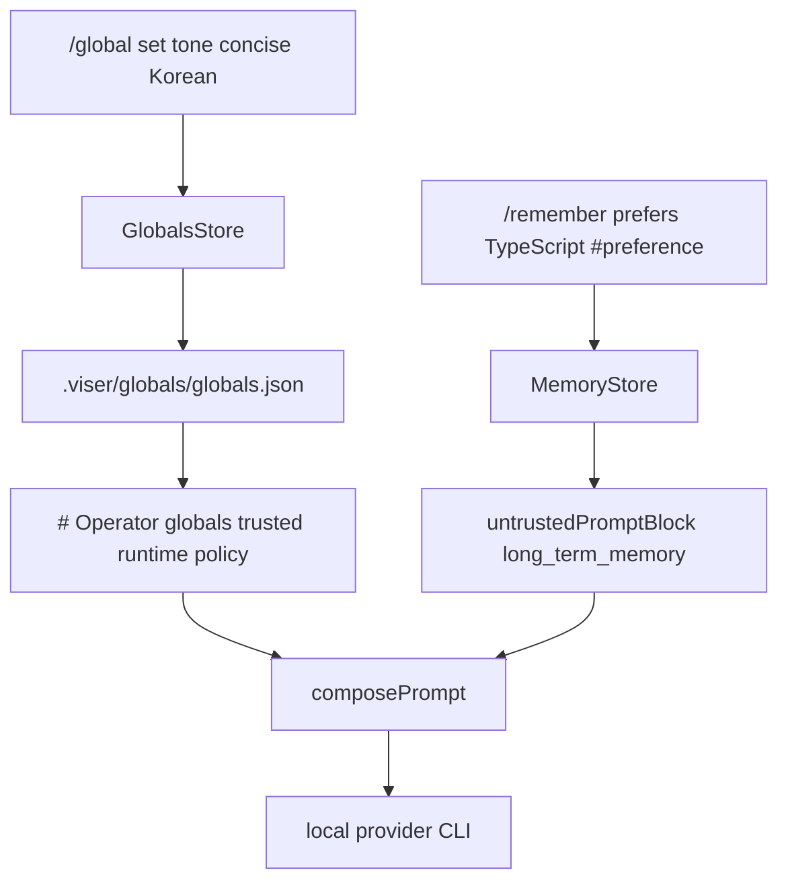
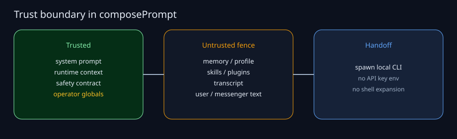

# Part 3 — Operator globals and persona

Long-term memory already stored facts. The remaining gap was **always-on
persona policy**: speech style, personality, and user facts that must survive
session reset and must not be treated as untrusted chat text.

## Why globals are not memory

| | Memory (`/remember`) | Globals (`/global`) |
| --- | --- | --- |
| Source | inferred or tagged notes | explicit operator command |
| Prompt role | untrusted user-derived data | trusted runtime policy |
| Lifetime | searchable JSONL | durable `globals.json` |
| Injection | relevant hits only | every provider prompt |
| Injection risk | fenced untrusted block | refused at write if high-risk |



## Keys

Reserved aliases:

- `tone` / `voice`
- `style` / `speech`
- `personality` / `persona` / `character`
- `user` / `about-user` / `user-info`
- `facts` / `user-facts`

Custom keys must match `^[a-z][a-z0-9-]{0,31}$`. Defaults cap each value at
1000 characters and the catalog at 24 keys.

## Commands

```bash
node src/index.ts global set tone concise Korean
node src/index.ts global set personality practical and direct
node src/index.ts global set user prefers TypeScript-first answers
node src/index.ts global
node src/index.ts global clear tone
```

Inside chat the same surface is `/global`, `/set-global`, and `/clear-global`.

## Prompt placement

The composed prompt order is:

1. System prompt
2. Runtime context
3. Prompt safety contract
4. **Operator globals** (trusted, not fenced)
5. Untrusted profile / memory / skills / plugins / transcript / user message

High-risk prompt-injection content is rejected when setting a global. If a
stored value later matches the guard, it is omitted at read time rather than
injected as policy.


