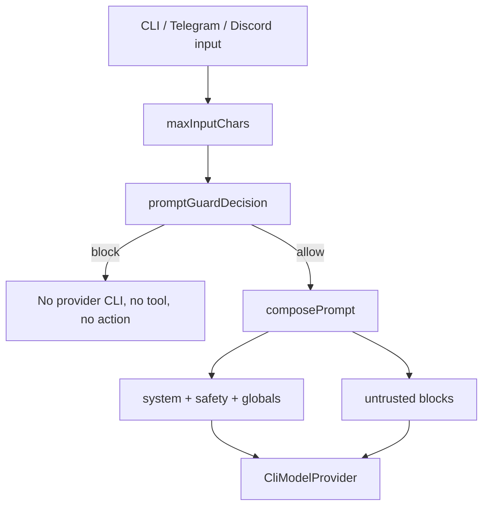

# Part 4 — Security boundaries

Secure coding here is mostly fail-closed local policy, not a bolt-on scanner.

## Prompt injection

`src/core/prompt-guard.ts` inspects user input before any provider spawn.
High-risk signals (`instruction-override`, `secret-exfiltration`,
`approval-bypass`, `role-impersonation`, `jailbreak`, plus obfuscated/base64
variants) block the handoff. Untrusted content is wrapped in:

```text
<<<VISER_UNTRUSTED_BLOCK_START ... >>>
...
<<<VISER_UNTRUSTED_BLOCK_END>>>
```

Operator globals sit *above* that fence, so a Telegram message cannot quietly
overwrite persona policy. `/global set` and `/global clear` are CLI-only;
messenger chats may list globals. Writes that contain injection or model API
key instructions are refused, and unsafe stored values are omitted at prompt
injection.



## Local spawn hygiene

- `spawn(command, args)` with `shell: false`
- no inherited secret-looking env by default
- symlink-refusing private state (`0o700` dirs, `0o600` files)
- stdin EPIPE from short-lived probe CLIs is ignored so a closed stdin cannot
  crash a readiness probe

## Approval-gated mutation

File writes, URL/mail/TTS/calendar/notification/clipboard, and outbound
messenger sends still require `/propose` then `/approve`. The model never gets
hidden write tools.

## Messenger abuse controls

Telegram/Discord default to pairing, per-peer rate limits, and inbound input
caps. Relaying a single-seat subscription to other people remains a ToS/ban
risk; `connectors.acknowledgeRelayToS` is the explicit acknowledgement.

## Fetch timeouts

`fetchWithTimeout` races the network call against a real timer. A stalled Bot
API or Discord REST call must fail in milliseconds for launch gates, not hang
the Node event loop. Tests cover hanging fetch doubles.
