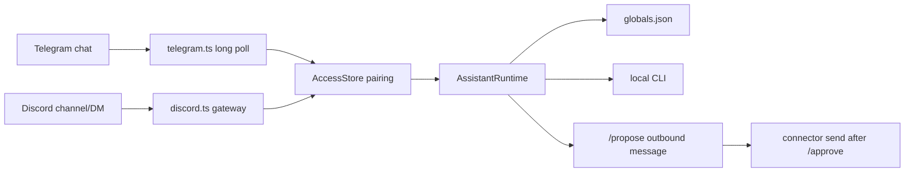

# Part 5 — Messengers and gateway

Discord and Telegram are transport, not model providers. Both connectors call
the same `AssistantRuntime` that CLI `chat` uses.



## Pairing

Default policy is pairing, not open relay:

```bash
node src/index.ts pair-code telegram demo-user
# then send /pair <code> from the target chat
```

Allowlists can pin chat/channel ids. `open` policy is an audit failure.

## Gateway

`node src/index.ts gateway` is the foreground control plane: enabled
connectors, scheduler, and optional localhost dashboard. Dry-run
`--strict --live --probe-all-providers` is the rehearsal before leaving it
running.

The dashboard stays read-only. It can show globals counts and provider install
state, but it cannot call providers, write files, or execute jobs.

## Operator loop

```text
onboard / setup
  -> login one local CLI
  -> /global set tone ...
  -> /remember durable facts
  -> verify / smoke / audit
  -> chat or gateway
```
