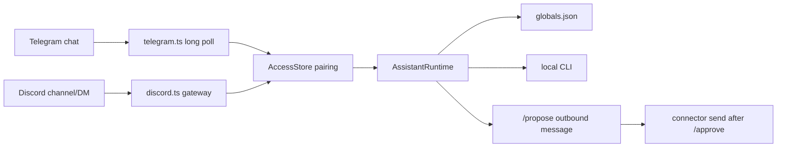

# Part 5 — Messengers and gateway

Discord and Telegram are transport, not model providers. Both connectors call
the same `AssistantRuntime` that CLI `chat` uses.



## Pairing

Default policy is pairing, not open relay:

```bash
node src/index.ts pair-code telegram demo-user
# then send /pair <code> from the target chat
```

Allowlists can pin chat/channel ids. `open` policy is an audit failure.

## Gateway

`node src/index.ts gateway` is the foreground control plane: enabled
connectors, scheduler, job worker, and optional localhost dashboard. Dry-run
`--strict --live --probe-all-providers` is the rehearsal before leaving it
running. Inbound Telegram/Discord/Slack/Matrix/Signal/iMessage/WhatsApp/LINE
ACK immediately, then send the final answer or error. Jobs queued from those
chats report start/done/failed/deferred back to the same chat after pairing.

KakaoTalk Open Builder Skill is request/response only. Viser records
`kakaotalk:` delivery so `/schedule` from KakaoTalk is not silently lost, but
it cannot push follow-ups. Use ntfy/telegram or the host console instead.

SSH sessions print a laptop-side `ssh -N -L <port>:127.0.0.1:<port> USER@HOST`
command instead of asking the operator to open the server's loopback URL.
Keep the dashboard on 127.0.0.1; WebChat stays localhost-only even with
`allowRemote`. For 24h use on a Linux CLI server, `viser service install`
plus `loginctl enable-linger "$USER"` keeps the systemd --user unit after
logout. The generated unit uses `Restart=always` plus `RestartPreventExitStatus=0`
so crash/non-zero restarts, while a blocked preflight exit 0 does not.
Viser never runs `loginctl enable-linger` for you.

The dashboard stays read-only. It can show globals counts and provider install
state, but it cannot call providers, write files, or execute jobs.

## Operator loop

```text
onboard / setup
  -> login one local CLI
  -> /global set tone ...
  -> /remember durable facts
  -> verify / smoke / audit
  -> chat or gateway
```
