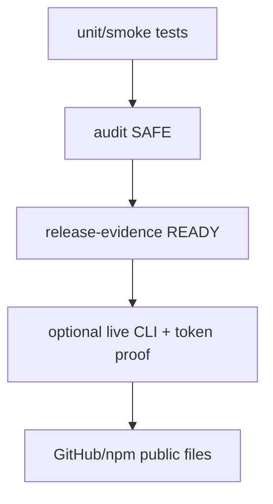

# Part 6 — Verification and public release

This completion is meant to be GitHub-public. Verification therefore has to
prove both behavior and hygiene.

## Local proof used during this completion

```bash
./node_modules/.bin/tsc --noEmit --pretty false
node --test test/globals.test.ts test/exec.test.ts test/onboard.test.ts \
  test/setup.test.ts test/release-evidence.test.ts test/config-validation.test.ts \
  test/assistant.test.ts test/connectors.test.ts test/validate.test.ts
npm test
```

Observed in this workspace:

- focused Node tests: 79 pass
- full `npm test`: 466 pass
- TypeScript `--noEmit`: pass

Live `codex` / `gemini` / `claude` / `grok` / `cursor-agent` login proof and
real Telegram/Discord tokens remain operator-local. `release-evidence --strict
--live --probe-all-providers` is expected to stay unproven until those logins
exist.

## Evidence matrix additions

`release-evidence` now checks:

- Grok route uses `grok`
- Cursor route uses `cursor-agent`
- `src/core/globals.ts` exists
- local smoke covers `/global set` persistence and prompt injection



## What stays private

Do not commit:

- `.env`, `.npmrc` secrets, `viser.config.json`
- `.viser/` sessions, memory, globals, jobs, access, backups
- real Telegram/Discord tokens or chat ids
- model API keys of any name

Public identity is only **Viser** and creator **KMokky**.

## Operator first run after this completion

```bash
node src/index.ts onboard
codex login   # or gemini / claude / grok / cursor-agent
node src/index.ts global set tone concise Korean
node src/index.ts global set personality practical and direct
node src/index.ts chat
```
