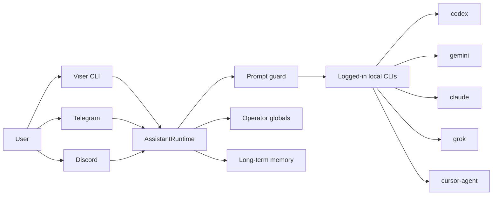
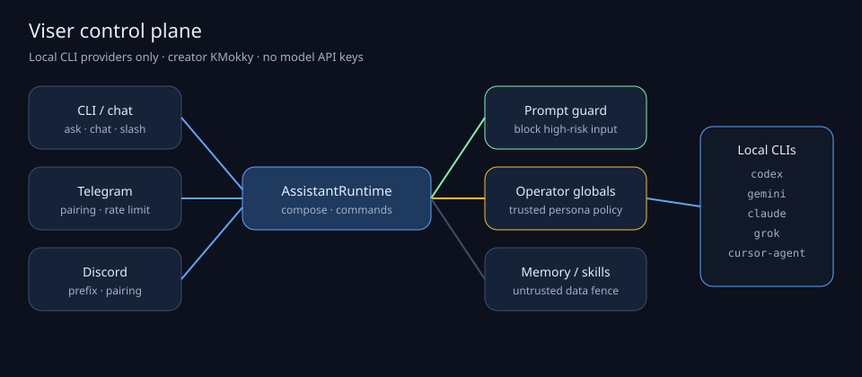

# Viser build journals

Creator: **KMokky**

These notes record how the remaining OpenClaw/Hermes-style completion landed:
logged-in local CLI providers, always-on persona globals, and the security
boundaries that keep untrusted messenger/user text from becoming higher-priority
policy.

The older chronological log remains in [`aimake.md`](../../aimake.md). This
folder is the illustrated, part-split companion for the current completion.

## Parts

1. [Identity and principles](01-identity-and-principles.md)
2. [Local CLI providers](02-local-cli-providers.md)
3. [Operator globals and persona](03-operator-globals.md)
4. [Security boundaries](04-security-boundaries.md)
5. [Messengers and gateway](05-messengers-and-gateway.md)
6. [Verification and public release](06-verification-and-release.md)

## System sketch

No GPT/Gemini/Claude/Grok/Cursor HTTP model APIs are used. Transport tokens for
Telegram/Discord stay in `.env` and never become model API keys.
